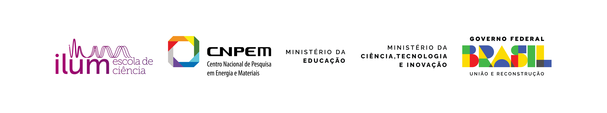

# 🛒 NHAM! Mini Mercado Inteligente para Universidades

## Sobre o Projeto

O **NHAM!** é um protótipo de minimercado inteligente voltado para ambientes universitários, desenvolvido como parte da disciplina de **Processos e Modelos de Inovação**.
A proposta busca oferecer uma solução prática para estudantes que necessitam de acesso rápido a alimentos, bebidas e itens de conveniência dentro do campus, reduzindo filas e ampliando a disponibilidade de produtos ao longo do dia.

---

## Problema

Em muitos campi universitários, os usuários enfrentam dificuldades para adquirir refeições rápidas e produtos essenciais devido a:

- Horários limitados de funcionamento de cantinas;
- Filas em períodos de pico;
- Pouca disponibilidade de opções saudáveis;
- Falta de acesso a itens de conveniência durante o expediente.

---

## Solução Proposta

O NHAM! consiste em uma plataforma digital que permite visualizar produtos disponíveis em um minimercado autônomo dentro da universidade.

O aplicativo apresenta:

- Catálogo de produtos organizado por categorias;
- Informações de preço e disponibilidade;
- Cardápio de marmitas prontas;
- Interface simples e intuitiva para dispositivos móveis;
- Experiência digital rápida para consulta e seleção de produtos.

---

## Público-Alvo

- Estudantes de graduação e pós-graduação;
- Professores;
- Técnicos administrativos;
- Visitantes do campus universitário.

---

## Funcionalidades

### 🛍️ Mini Mercado

- Bebidas
- Snacks e salgadinhos
- Doces
- Produtos refrigerados
- Itens de higiene e bem-estar

### 🍱 Marmitas

- Cardápio de refeições prontas
- Informações nutricionais
- Controle de disponibilidade
- Destaque para novidades e reposições

### 📱 Experiência do Usuário

- Navegação mobile-first
- Interface responsiva
- Organização por categorias
- Carrinho de compras local

---

## Tecnologias Utilizadas

- React
- TypeScript
- Vite
- Tailwind CSS
- Framer Motion
- Lucide React
- Loveable

---

## Diferenciais de Inovação

O projeto aplica conceitos de:

- Design Thinking;
- Inovação centrada no usuário;
- Transformação digital;
- Conveniência em ambientes educacionais;
- Promoção de hábitos alimentares mais saudáveis.

---

## Status do Projeto

🚧 **Protótipo acadêmico em desenvolvimento**

O sistema foi desenvolvido para fins educacionais e demonstração conceitual no contexto da disciplina de **Processos e Modelos de Inovação**.

---

## Autora

[**Brenda Laube Abrunhosa**](https://github.com/blabrunhosa): Estudante da Ilum - Escola de Ciências

